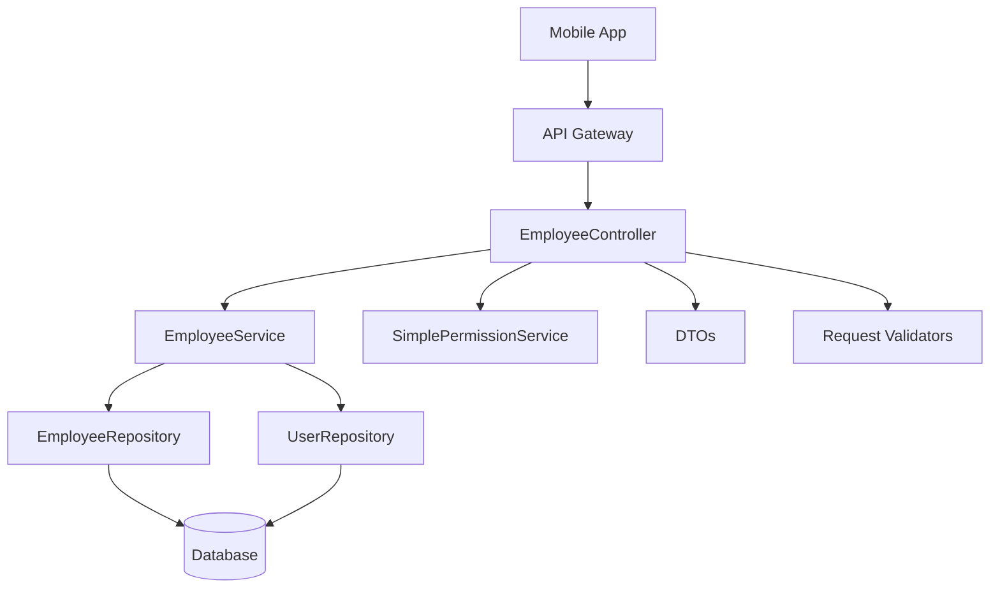

# تصميم نظام إدارة الموظفين - API

## نظرة عامة

يهدف هذا التصميم إلى توسيع EmployeeController الموجود في Laravel لإضافة وظائف شاملة لإدارة الموظفين، بناءً على النظام المرجعي المقدم. سيتم تطوير API endpoints محسنة للتطبيق المحمول مع الحفاظ على الأمان والأداء.

## البنية المعمارية

### المكونات الأساسية



### طبقات النظام

1. **طبقة التحكم (Controller Layer)**
   - EmployeeController: معالجة طلبات HTTP
   - التحقق من المصادقة والتفويض
   - تنسيق الاستجابات

2. **طبقة الخدمات (Service Layer)**
   - EmployeeService: منطق العمل الأساسي
   - SimplePermissionService: إدارة الصلاحيات
   - CacheService: إدارة التخزين المؤقت

3. **طبقة البيانات (Data Layer)**
   - Models: User, UserDetails, Department, Designation
   - Repositories: تجريد الوصول للبيانات
   - DTOs: نقل البيانات المنظم

## المكونات والواجهات

### 1. EmployeeController Methods

```php
class EmployeeController extends Controller
{
    // الوظائف الموجودة حالياً
    public function getEmployeesForDutyEmployee(Request $request)
    public function getDutyEmployeesForEmployee(GetBackupEmployeesRequest $request)
    public function getEmployeesForNotify(Request $request)
    public function getSubordinates(Request $request)
    public function getApprovalLevels(Request $request)
    
    // الوظائف الجديدة المطلوبة
    public function index(Request $request)                    // جلب قائمة الموظفين
    public function show($id)                                  // جلب موظف واحد
    public function store(CreateEmployeeRequest $request)      // إنشاء موظف جديد
    public function update(UpdateEmployeeRequest $request, $id) // تحديث موظف
    public function destroy($id)                               // حذف/إلغاء تفعيل موظف
    public function search(Request $request)                   // البحث المتقدم
    public function statistics(Request $request)               // إحصائيات الموظفين
    public function getEmployeeDocuments($id)                  // مستندات الموظف
    public function getEmployeeLeaveBalance($id)               // رصيد الإجازات
    public function getEmployeeAttendance($id)                 // سجل الحضور
    public function getEmployeeSalaryDetails($id)              // تفاصيل الراتب
}
```

### 2. Request DTOs

```php
// DTO للبحث والفلترة
class EmployeeFilterDTO
{
    public ?string $search = null;
    public ?int $department_id = null;
    public ?int $designation_id = null;
    public ?bool $is_active = null;
    public ?string $from_date = null;
    public ?string $to_date = null;
    public int $page = 1;
    public int $limit = 20;
}

// DTO لإنشاء موظف
class CreateEmployeeDTO
{
    public string $first_name;
    public string $last_name;
    public string $email;
    public string $username;
    public string $password;
    public ?string $contact_number = null;
    public ?string $gender = null;
    public int $department_id;
    public int $designation_id;
    public ?float $basic_salary = null;
    public ?string $date_of_joining = null;
    public ?string $date_of_birth = null;
    // ... باقي الحقول
}

// DTO لتحديث الموظف
class UpdateEmployeeDTO
{
    public ?string $first_name = null;
    public ?string $last_name = null;
    public ?string $email = null;
    public ?string $contact_number = null;
    public ?int $department_id = null;
    public ?int $designation_id = null;
    public ?float $basic_salary = null;
    public ?bool $is_active = null;
    // ... باقي الحقول
}
```

### 3. Response DTOs

```php
// DTO لاستجابة الموظف
class EmployeeResponseDTO
{
    public int $user_id;
    public string $employee_id;
    public string $first_name;
    public string $last_name;
    public string $full_name;
    public string $email;
    public ?string $contact_number;
    public ?string $gender;
    public ?int $department_id;
    public ?string $department_name;
    public ?int $designation_id;
    public ?string $designation_name;
    public ?float $basic_salary;
    public ?string $date_of_joining;
    public ?string $date_of_birth;
    public bool $is_active;
    public string $created_at;
}

// DTO لإحصائيات الموظفين
class EmployeeStatisticsDTO
{
    public int $total_employees;
    public int $active_employees;
    public int $inactive_employees;
    public int $departments_count;
    public int $designations_count;
    public ?float $average_salary;
    public array $employees_by_department;
    public array $employees_by_designation;
}
```

## نماذج البيانات

### 1. User Model (الموجود)
```php
class User extends Authenticatable
{
    protected $table = 'ci_erp_users';
    protected $primaryKey = 'user_id';
    
    // العلاقات
    public function userDetails()
    public function department()
    public function designation()
    public function company()
}
```

### 2. UserDetails Model (الموجود)
```php
class UserDetails extends Model
{
    protected $table = 'ci_erp_users_details';
    protected $primaryKey = 'staff_details_id';
    
    // العلاقات
    public function user()
    public function department()
    public function designation()
    public function reportingManager()
}
```

### 3. Repository Pattern

```php
interface EmployeeRepositoryInterface
{
    public function getAllEmployees(EmployeeFilterDTO $filters, int $companyId): LengthAwarePaginator;
    public function getEmployeeById(int $id, int $companyId): ?User;
    public function createEmployee(CreateEmployeeDTO $data, int $companyId): User;
    public function updateEmployee(int $id, UpdateEmployeeDTO $data, int $companyId): bool;
    public function deleteEmployee(int $id, int $companyId): bool;
    public function getEmployeeStatistics(int $companyId): array;
    public function searchEmployees(string $search, int $companyId): Collection;
}
```

## معالجة الأخطاء

### 1. Exception Classes

```php
class EmployeeNotFoundException extends Exception
{
    protected $message = 'الموظف غير موجود';
}

class EmployeePermissionException extends Exception
{
    protected $message = 'ليس لديك صلاحية للوصول لبيانات هذا الموظف';
}

class EmployeeValidationException extends Exception
{
    protected $message = 'بيانات الموظف غير صحيحة';
}
```

### 2. Error Response Format

```json
{
    "success": false,
    "message": "رسالة الخطأ بالعربية",
    "errors": {
        "field_name": ["رسالة الخطأ التفصيلية"]
    },
    "error_code": "EMPLOYEE_NOT_FOUND"
}
```

## استراتيجية الاختبار

### 1. Unit Tests
- اختبار كل method في EmployeeController
- اختبار DTOs والتحقق من صحة البيانات
- اختبار Repository methods
- اختبار Exception handling

### 2. Integration Tests
- اختبار API endpoints كاملة
- اختبار التكامل مع قاعدة البيانات
- اختبار الصلاحيات والأمان
- اختبار الاستجابات والتنسيق

### 3. Feature Tests
- اختبار سيناريوهات المستخدم الكاملة
- اختبار البحث والفلترة
- اختبار CRUD operations
- اختبار التطبيق المحمول scenarios

## خصائص الصحة

*الخاصية هي سمة أو سلوك يجب أن يكون صحيحاً عبر جميع عمليات التنفيذ الصالحة للنظام - في الأساس، بيان رسمي حول ما يجب أن يفعله النظام. تعمل الخصائص كجسر بين المواصفات المقروءة بواسطة الإنسان وضمانات الصحة القابلة للتحقق آلياً.*

### خصائص جلب قائمة الموظفين

**الخاصية 1: فلترة الموظفين النشطين حسب الشركة**
*لأي* طلب لجلب قائمة الموظفين، يجب أن تحتوي النتائج فقط على الموظفين النشطين الذين ينتمون لشركة المستخدم
**تتحقق من: المتطلبات 1.1**

**الخاصية 2: اكتمال البيانات الأساسية**
*لكل* موظف في قائمة الموظفين المرجعة، يجب أن تتضمن البيانات الاسم الأول والأخير والبريد الإلكتروني ورقم الموظف واسم القسم واسم المسمى الوظيفي
**تتحقق من: المتطلبات 1.2**

**الخاصية 3: صلاحيات مستخدم الشركة**
*لأي* مستخدم من نوع شركة، يجب أن يحصل على جميع موظفي شركته عند طلب قائمة الموظفين
**تتحقق من: المتطلبات 1.3**

**الخاصية 4: الصلاحيات الهرمية للموظفين**
*لأي* موظف عادي، يجب أن تحتوي قائمة الموظفين المرجعة فقط على الموظفين الذين يحق له رؤيتهم حسب المستوى الهرمي
**تتحقق من: المتطلبات 1.4**

**الخاصية 5: دعم التصفح**
*لأي* طلب لجلب قائمة الموظفين مع تحديد حد للنتائج، يجب أن يدعم النظام تقسيم النتائج على صفحات مع معلومات التصفح
**تتحقق من: المتطلبات 1.5**

### خصائص البحث والفلترة

**الخاصية 6: البحث النصي الشامل**
*لأي* نص بحث مدخل، يجب أن تحتوي النتائج على الموظفين الذين يطابق النص أسماءهم الأولى أو الأخيرة أو بريدهم الإلكتروني أو رقم الموظف
**تتحقق من: المتطلبات 2.1**

**الخاصية 7: فلترة حسب القسم**
*لأي* قسم محدد في الفلترة، يجب أن تحتوي النتائج فقط على الموظفين المنتمين لهذا القسم
**تتحقق من: المتطلبات 2.2**

**الخاصية 8: فلترة حسب المسمى الوظيفي**
*لأي* مسمى وظيفي محدد في الفلترة، يجب أن تحتوي النتائج فقط على الموظفين الذين يحملون هذا المسمى
**تتحقق من: المتطلبات 2.3**

**الخاصية 9: فلترة حسب حالة التفعيل**
*لأي* حالة تفعيل محددة (نشط/غير نشط)، يجب أن تحتوي النتائج فقط على الموظفين بهذه الحالة
**تتحقق من: المتطلبات 2.4**

**الخاصية 10: فلترة حسب تاريخ التوظيف**
*لأي* نطاق تاريخي محدد للتوظيف، يجب أن تحتوي النتائج فقط على الموظفين المعينين في هذا النطاق
**تتحقق من: المتطلبات 2.5**

**الخاصية 11: دمج الفلاتر المتعددة**
*لأي* مجموعة من الفلاتر المطبقة معاً، يجب أن تحتوي النتائج على الموظفين الذين يطابقون جميع المعايير المحددة
**تتحقق من: المتطلبات 2.6**

### خصائص جلب تفاصيل الموظف

**الخاصية 12: اكتمال البيانات الشخصية والوظيفية**
*لأي* طلب لجلب تفاصيل موظف موجود، يجب أن تتضمن الاستجابة جميع البيانات الشخصية والوظيفية المطلوبة
**تتحقق من: المتطلبات 3.1**

**الخاصية 13: تضمين البيانات المرتبطة**
*لأي* موظف مرجع، يجب أن تتضمن تفاصيله معلومات القسم والمسمى الوظيفي والشركة المرتبطة
**تتحقق من: المتطلبات 3.2**

**الخاصية 14: تضمين المستندات**
*لأي* موظف له مستندات مرفقة، يجب أن تتضمن تفاصيله قائمة بهذه المستندات
**تتحقق من: المتطلبات 3.3**

**الخاصية 15: تضمين رصيد الإجازات**
*لأي* موظف له سجل إجازات، يجب أن تتضمن تفاصيله رصيد الإجازات الحالي
**تتحقق من: المتطلبات 3.4**

**الخاصية 16: تضمين سجل الحضور**
*لأي* موظف له سجل حضور، يجب أن تتضمن تفاصيله سجل الحضور الأخير
**تتحقق من: المتطلبات 3.5**

### خصائص الإحصائيات

**الخاصية 17: حساب العدد الإجمالي**
*لأي* طلب إحصائيات، يجب أن يكون العدد الإجمالي للموظفين مطابقاً لعدد الموظفين الفعلي في الشركة
**تتحقق من: المتطلبات 4.1**

**الخاصية 18: تصنيف حسب حالة التفعيل**
*لأي* إحصائيات مرجعة، يجب أن يكون مجموع الموظفين النشطين وغير النشطين مساوياً للعدد الإجمالي
**تتحقق من: المتطلبات 4.2**

**الخاصية 19: إحصائيات الهيكل التنظيمي**
*لأي* إحصائيات مرجعة، يجب أن تتضمن العدد الصحيح للأقسام والمسميات الوظيفية في الشركة
**تتحقق من: المتطلبات 4.3**

**الخاصية 20: حساب متوسط الراتب**
*لأي* إحصائيات تتضمن متوسط الراتب، يجب أن يكون المتوسط محسوباً بشكل صحيح من رواتب جميع الموظفين النشطين
**تتحقق من: المتطلبات 4.4**

**الخاصية 21: تطبيق قيود الصلاحيات على الإحصائيات**
*لأي* مستخدم يطلب إحصائيات، يجب أن تعكس الإحصائيات فقط الموظفين الذين يحق له رؤيتهم
**تتحقق من: المتطلبات 4.5**

### خصائص إنشاء الموظف

**الخاصية 22: التحقق من صحة البيانات**
*لأي* طلب إنشاء موظف، يجب أن يتم التحقق من صحة جميع البيانات المطلوبة قبل الحفظ
**تتحقق من: المتطلبات 5.1**

**الخاصية 23: إنشاء السجلات المترابطة**
*لأي* موظف جديد بيانات صحيحة، يجب أن يتم إنشاء حساب المستخدم وتفاصيل الموظف في قاعدة البيانات
**تتحقق من: المتطلبات 5.2**

**الخاصية 24: توليد رقم موظف فريد**
*لكل* موظف جديد يتم إنشاؤه، يجب أن يحصل على رقم موظف فريد لا يتكرر مع أي موظف آخر في الشركة
**تتحقق من: المتطلبات 5.3**

**الخاصية 25: ربط البيانات التنظيمية**
*لأي* موظف جديد، يجب أن يتم ربطه بالشركة والقسم المحددين في البيانات
**تتحقق من: المتطلبات 5.4**

**الخاصية 26: معالجة أخطاء الإنشاء**
*لأي* طلب إنشاء موظف ببيانات خاطئة، يجب أن يرجع النظام رسائل خطأ واضحة ومفيدة
**تتحقق من: المتطلبات 5.5**

### خصائص تحديث الموظف

**الخاصية 27: التحقق من صحة التحديثات**
*لأي* طلب تحديث بيانات موظف، يجب أن يتم التحقق من صحة البيانات الجديدة قبل الحفظ
**تتحقق من: المتطلبات 6.1**

**الخاصية 28: حفظ التحديثات**
*لأي* تحديث ببيانات صحيحة، يجب أن يتم حفظ التغييرات في قاعدة البيانات بنجاح
**تتحقق من: المتطلبات 6.2**

**الخاصية 29: تسجيل التغييرات**
*لأي* تحديث ناجح لبيانات موظف، يجب أن يتم تسجيل التغيير مع معرف المستخدم والوقت
**تتحقق من: المتطلبات 6.3**

**الخاصية 30: صلاحيات التحديث**
*لأي* مستخدم لا يملك صلاحية تحديث موظف معين، يجب أن يرفض النظام العملية
**تتحقق من: المتطلبات 6.5**

### خصائص حذف الموظف

**الخاصية 31: الحذف الآمن**
*لأي* طلب حذف موظف، يجب أن يتم إلغاء تفعيل الحساب مع الحفاظ على جميع البيانات في قاعدة البيانات
**تتحقق من: المتطلبات 7.1**

**الخاصية 32: تسجيل تاريخ المغادرة**
*لأي* موظف يتم إلغاء تفعيله، يجب أن يتم تسجيل تاريخ المغادرة في سجله
**تتحقق من: المتطلبات 7.2**

**الخاصية 33: الحفاظ على السجلات التاريخية**
*لأي* موظف يتم إلغاء تفعيله، يجب أن تبقى جميع سجلاته التاريخية (الحضور، الإجازات، الرواتب) محفوظة
**تتحقق من: المتطلبات 7.3**

**الخاصية 34: صلاحيات الحذف**
*لأي* مستخدم لا يملك صلاحية حذف موظف معين، يجب أن يرفض النظام العملية
**تتحقق من: المتطلبات 7.5**

### خصائص الأمان

**الخاصية 35: التحقق من المصادقة**
*لأي* طلب لأي endpoint، يجب أن يتم التحقق من صحة رمز المصادقة قبل المعالجة
**تتحقق من: المتطلبات 8.1**

**الخاصية 36: تطبيق قيود الشركة والقسم**
*لأي* مستخدم يطلب بيانات موظفين، يجب أن تطبق قيود الوصول حسب شركته وقسمه
**تتحقق من: المتطلبات 8.2**

**الخاصية 37: رفض الوصول غير المصرح**
*لأي* محاولة وصول لبيانات خارج صلاحيات المستخدم، يجب أن يرفض النظام الطلب
**تتحقق من: المتطلبات 8.3**

**الخاصية 38: تسجيل العمليات**
*لكل* عملية يتم تنفيذها، يجب أن يتم تسجيل معرف المستخدم والوقت في سجل النظام
**تتحقق من: المتطلبات 8.4**

**الخاصية 39: تسجيل الأخطاء الأمنية**
*لأي* خطأ أمني يحدث، يجب أن يتم تسجيله في سجل الأمان مع التفاصيل المناسبة
**تتحقق من: المتطلبات 8.5**

### خصائص استجابات API

**الخاصية 40: تنسيق الاستجابات الناجحة**
*لأي* طلب API ناجح، يجب أن تكون الاستجابة بتنسيق JSON موحد مع حقول success وdata
**تتحقق من: المتطلبات 9.1، 9.3**

**الخاصية 41: رسائل الخطأ الواضحة**
*لأي* طلب API فاشل، يجب أن تحتوي الاستجابة على رسالة خطأ واضحة باللغة العربية
**تتحقق من: المتطلبات 9.2**

**الخاصية 42: رموز حالة HTTP المناسبة**
*لأي* خطأ يحدث، يجب أن يرجع النظام رمز حالة HTTP مناسب للنوع المحدد من الخطأ
**تتحقق من: المتطلبات 9.4**

**الخاصية 43: معلومات التصفح للقوائم**
*لأي* استجابة تحتوي على قائمة مقسمة على صفحات، يجب أن تتضمن معلومات التصفح (الصفحة الحالية، العدد الإجمالي، عدد الصفحات)
**تتحقق من: المتطلبات 9.5**

### خصائص دعم التطبيق المحمول

**الخاصية 44: تنسيق البيانات للجوال**
*لأي* طلب من التطبيق المحمول، يجب أن تكون البيانات المرجعة بتنسيق مناسب ومحسن للعرض على الجوال
**تتحقق من: المتطلبات 10.1**

**الخاصية 45: التحميل التدريجي**
*لأي* بيانات كبيرة، يجب أن يدعم النظام تقسيمها وتحميلها تدريجياً لتحسين الأداء
**تتحقق من: المتطلبات 10.2**

**الخاصية 46: روابط الصور المحسنة**
*لأي* طلب لصور الموظفين، يجب أن ترجع روابط محسنة للصور بأحجام مناسبة للتطبيق المحمول
**تتحقق من: المتطلبات 10.3**

**الخاصية 47: ضغط الاستجابات**
*لأي* استجابة كبيرة الحجم، يجب أن يتم ضغطها عند الحاجة لتحسين الأداء على الشبكات البطيئة
**تتحقق من: المتطلبات 10.5**

## معالجة الأخطاء

### استراتيجية معالجة الأخطاء

1. **أخطاء التحقق من صحة البيانات**
   - إرجاع رمز 422 مع تفاصيل الأخطاء
   - رسائل خطأ واضحة لكل حقل

2. **أخطاء المصادقة والتفويض**
   - إرجاع رمز 401 للمصادقة
   - إرجاع رمز 403 للتفويض
   - رسائل خطأ أمنية مناسبة

3. **أخطاء عدم وجود الموارد**
   - إرجاع رمز 404
   - رسائل واضحة عن المورد المفقود

4. **أخطاء الخادم الداخلية**
   - إرجاع رمز 500
   - تسجيل تفاصيل الخطأ
   - رسالة عامة للمستخدم

### تنسيق رسائل الخطأ

```json
{
    "success": false,
    "message": "رسالة الخطأ الرئيسية",
    "errors": {
        "field_name": ["رسالة الخطأ التفصيلية"]
    },
    "error_code": "EMPLOYEE_VALIDATION_ERROR"
}
```

## استراتيجية الاختبار

### نهج الاختبار المزدوج

**اختبارات الوحدة (Unit Tests)**:
- اختبار أمثلة محددة وحالات الحافة وشروط الخطأ
- اختبار نقاط التكامل بين المكونات
- التركيز على السيناريوهات المحددة

**اختبارات الخصائص (Property Tests)**:
- التحقق من الخصائص العامة عبر جميع المدخلات
- تغطية شاملة للمدخلات من خلال العشوائية
- التركيز على القواعد العامة والثوابت

### متطلبات اختبار الخصائص

- الحد الأدنى 100 تكرار لكل اختبار خاصية
- كل اختبار خاصية يجب أن يشير إلى خاصية مستند التصميم
- تنسيق العلامة: **Feature: employee-management-api, Property {number}: {property_text}**
- كل خاصية صحة يجب أن تُنفذ بواسطة اختبار خاصية واحد

### مكتبة اختبار الخصائص

سيتم استخدام **Pest** مع **Property Testing** في Laravel لتنفيذ اختبارات الخصائص، مع دعم مولدات البيانات العشوائية المخصصة لنماذج الموظفين.

## النظام الهرمي وقيود العمليات

### 1. النظام الهرمي (Hierarchy System)

#### مستويات الهرم التنظيمي

```php
enum HierarchyLevel: int
{
    case CEO = 1;           // المدير التنفيذي
    case MANAGER = 2;       // مدير عام
    case DEPARTMENT_HEAD = 3; // رئيس قسم
    case SUPERVISOR = 4;    // مشرف
    case EMPLOYEE = 5;      // موظف عادي
}
```

#### قواعد الوصول الهرمي

1. **المدير التنفيذي (Level 1)**
   - يرى جميع الموظفين في الشركة
   - يمكنه تعديل وحذف أي موظف
   - يمكنه الوصول لجميع الإحصائيات

2. **المدير العام (Level 2)**
   - يرى الموظفين في مستواه وما دونه
   - يمكنه تعديل الموظفين في المستويات الأدنى
   - لا يمكنه تعديل موظفين في نفس المستوى أو أعلى

3. **رئيس القسم (Level 3)**
   - يرى موظفي قسمه فقط في المستويات الأدنى
   - يمكنه تعديل المشرفين والموظفين في قسمه
   - لا يمكنه رؤية موظفي الأقسام الأخرى

4. **المشرف (Level 4)**
   - يرى الموظفين العاديين تحت إشرافه
   - يمكنه عرض بيانات الموظفين فقط
   - لا يمكنه التعديل أو الحذف

5. **الموظف العادي (Level 5)**
   - يرى بياناته الشخصية فقط
   - لا يمكنه رؤية بيانات موظفين آخرين
   - لا يمكنه التعديل أو الحذف

#### تنفيذ النظام الهرمي

```php
class HierarchyService
{
    public function canViewEmployee(User $viewer, User $target): bool
    {
        // نفس الشركة
        if ($viewer->company_id !== $target->company_id) {
            return false;
        }
        
        // مستخدم الشركة يرى الجميع
        if ($viewer->user_type === 'company') {
            return true;
        }
        
        $viewerLevel = $viewer->userDetails->designation->hierarchy_level ?? 5;
        $targetLevel = $target->userDetails->designation->hierarchy_level ?? 5;
        
        // المستوى الأعلى يرى المستويات الأدنى
        if ($viewerLevel < $targetLevel) {
            return true;
        }
        
        // نفس المستوى في نفس القسم
        if ($viewerLevel === $targetLevel && 
            $viewer->userDetails->department_id === $target->userDetails->department_id) {
            return true;
        }
        
        // يرى نفسه
        return $viewer->user_id === $target->user_id;
    }
    
    public function canEditEmployee(User $editor, User $target): bool
    {
        if (!$this->canViewEmployee($editor, $target)) {
            return false;
        }
        
        // مستخدم الشركة يعدل الجميع
        if ($editor->user_type === 'company') {
            return true;
        }
        
        $editorLevel = $editor->userDetails->designation->hierarchy_level ?? 5;
        $targetLevel = $target->userDetails->designation->hierarchy_level ?? 5;
        
        // يمكن التعديل فقط للمستويات الأدنى
        return $editorLevel < $targetLevel;
    }
    
    public function getAccessibleEmployees(User $user): Builder
    {
        $query = User::where('company_id', $user->company_id);
        
        if ($user->user_type === 'company') {
            return $query;
        }
        
        $userLevel = $user->userDetails->designation->hierarchy_level ?? 5;
        $userDepartment = $user->userDetails->department_id;
        
        return $query->whereHas('userDetails', function ($q) use ($userLevel, $userDepartment, $user) {
            $q->where(function ($subQ) use ($userLevel, $userDepartment, $user) {
                // المستويات الأدنى
                $subQ->where('hierarchy_level', '>', $userLevel)
                     // أو نفس المستوى في نفس القسم
                     ->orWhere(function ($sameLevel) use ($userLevel, $userDepartment) {
                         $sameLevel->where('hierarchy_level', $userLevel)
                                  ->where('department_id', $userDepartment);
                     })
                     // أو نفس المستخدم
                     ->orWhere('user_id', $user->user_id);
            });
        });
    }
}
```

### 2. قيود العمليات (Operation Restrictions)

#### نموذج قيود العمليات

```php
class OperationRestriction extends Model
{
    protected $table = 'ci_operation_restrictions';
    
    protected $fillable = [
        'company_id',
        'user_id',
        'operation_type',
        'restriction_type',
        'restriction_value',
        'is_active'
    ];
    
    // أنواع العمليات
    const OPERATION_VIEW = 'view';
    const OPERATION_CREATE = 'create';
    const OPERATION_UPDATE = 'update';
    const OPERATION_DELETE = 'delete';
    
    // أنواع القيود
    const RESTRICTION_DEPARTMENT = 'department';
    const RESTRICTION_HIERARCHY = 'hierarchy';
    const RESTRICTION_TIME = 'time';
    const RESTRICTION_IP = 'ip';
}
```

#### خدمة قيود العمليات

```php
class OperationRestrictionService
{
    public function checkRestrictions(User $user, string $operation, array $context = []): bool
    {
        $restrictions = OperationRestriction::where('company_id', $user->company_id)
            ->where('user_id', $user->user_id)
            ->where('operation_type', $operation)
            ->where('is_active', true)
            ->get();
            
        foreach ($restrictions as $restriction) {
            if (!$this->evaluateRestriction($restriction, $context)) {
                return false;
            }
        }
        
        return true;
    }
    
    private function evaluateRestriction(OperationRestriction $restriction, array $context): bool
    {
        switch ($restriction->restriction_type) {
            case OperationRestriction::RESTRICTION_DEPARTMENT:
                return $this->checkDepartmentRestriction($restriction, $context);
                
            case OperationRestriction::RESTRICTION_HIERARCHY:
                return $this->checkHierarchyRestriction($restriction, $context);
                
            case OperationRestriction::RESTRICTION_TIME:
                return $this->checkTimeRestriction($restriction);
                
            case OperationRestriction::RESTRICTION_IP:
                return $this->checkIpRestriction($restriction);
                
            default:
                return true;
        }
    }
    
    private function checkDepartmentRestriction(OperationRestriction $restriction, array $context): bool
    {
        $allowedDepartments = json_decode($restriction->restriction_value, true);
        $targetDepartment = $context['department_id'] ?? null;
        
        return in_array($targetDepartment, $allowedDepartments);
    }
    
    private function checkHierarchyRestriction(OperationRestriction $restriction, array $context): bool
    {
        $maxLevel = (int) $restriction->restriction_value;
        $targetLevel = $context['hierarchy_level'] ?? 5;
        
        return $targetLevel >= $maxLevel;
    }
    
    private function checkTimeRestriction(OperationRestriction $restriction): bool
    {
        $timeRange = json_decode($restriction->restriction_value, true);
        $currentTime = now()->format('H:i');
        
        return $currentTime >= $timeRange['start'] && $currentTime <= $timeRange['end'];
    }
    
    private function checkIpRestriction(OperationRestriction $restriction): bool
    {
        $allowedIps = json_decode($restriction->restriction_value, true);
        $clientIp = request()->ip();
        
        return in_array($clientIp, $allowedIps);
    }
}
```

## Resource Files لعرض البيانات

### 1. EmployeeResource

```php
<?php

namespace App\Http\Resources;

use Illuminate\Http\Request;
use Illuminate\Http\Resources\Json\JsonResource;

class EmployeeResource extends JsonResource
{
    /**
     * Transform the resource into an array.
     */
    public function toArray(Request $request): array
    {
        return [
            'user_id' => $this->user_id,
            'employee_id' => $this->userDetails->employee_id ?? null,
            'first_name' => $this->first_name,
            'last_name' => $this->last_name,
            'full_name' => $this->first_name . ' ' . $this->last_name,
            'email' => $this->email,
            'username' => $this->username,
            'contact_number' => $this->contact_number,
            'gender' => $this->gender,
            'profile_photo' => $this->profile_photo ? url('storage/' . $this->profile_photo) : null,
            
            // معلومات الوظيفة
            'department' => new DepartmentResource($this->whenLoaded('department')),
            'designation' => new DesignationResource($this->whenLoaded('designation')),
            'basic_salary' => $this->userDetails->basic_salary ?? null,
            'hourly_rate' => $this->userDetails->hourly_rate ?? null,
            'salary_type' => $this->userDetails->salary_type ?? null,
            'currency' => $this->userDetails->currency ?? null,
            
            // التواريخ
            'date_of_joining' => $this->userDetails->date_of_joining ?? null,
            'date_of_birth' => $this->userDetails->date_of_birth ?? null,
            'date_of_leaving' => $this->userDetails->date_of_leaving ?? null,
            
            // معلومات إضافية
            'marital_status' => $this->userDetails->marital_status ?? null,
            'blood_group' => $this->userDetails->blood_group ?? null,
            'bio' => $this->userDetails->bio ?? null,
            
            // معلومات الحالة
            'is_active' => (bool) $this->is_active,
            'last_login_date' => $this->last_login_date,
            'created_at' => $this->created_at,
            'updated_at' => $this->updated_at,
            
            // معلومات إضافية حسب الطلب
            'documents' => DocumentResource::collection($this->whenLoaded('documents')),
            'leave_balance' => $this->when($this->relationLoaded('leaveBalance'), 
                fn() => LeaveBalanceResource::collection($this->leaveBalance)),
            'attendance_records' => $this->when($this->relationLoaded('attendanceRecords'),
                fn() => AttendanceResource::collection($this->attendanceRecords)),
            'salary_details' => $this->when($this->relationLoaded('salaryDetails'),
                fn() => SalaryDetailResource::collection($this->salaryDetails)),
        ];
    }
}
```

### 2. EmployeeListResource (للقوائم)

```php
<?php

namespace App\Http\Resources;

use Illuminate\Http\Request;
use Illuminate\Http\Resources\Json\JsonResource;

class EmployeeListResource extends JsonResource
{
    /**
     * Transform the resource into an array for list view.
     */
    public function toArray(Request $request): array
    {
        return [
            'user_id' => $this->user_id,
            'employee_id' => $this->userDetails->employee_id ?? null,
            'first_name' => $this->first_name,
            'last_name' => $this->last_name,
            'full_name' => $this->first_name . ' ' . $this->last_name,
            'email' => $this->email,
            'contact_number' => $this->contact_number,
            'profile_photo' => $this->profile_photo ? url('storage/' . $this->profile_photo) : null,
            
            // معلومات أساسية للقائمة
            'department_id' => $this->userDetails->department_id ?? null,
            'department_name' => $this->department->department_name ?? null,
            'designation_id' => $this->userDetails->designation_id ?? null,
            'designation_name' => $this->designation->designation_name ?? null,
            'hierarchy_level' => $this->designation->hierarchy_level ?? 5,
            
            'basic_salary' => $this->userDetails->basic_salary ?? null,
            'currency' => $this->userDetails->currency ?? null,
            'date_of_joining' => $this->userDetails->date_of_joining ?? null,
            
            'is_active' => (bool) $this->is_active,
            'last_login_date' => $this->last_login_date,
        ];
    }
}
```

### 3. DepartmentResource

```php
<?php

namespace App\Http\Resources;

use Illuminate\Http\Request;
use Illuminate\Http\Resources\Json\JsonResource;

class DepartmentResource extends JsonResource
{
    public function toArray(Request $request): array
    {
        return [
            'department_id' => $this->department_id,
            'department_name' => $this->department_name,
            'department_head_id' => $this->department_head,
            'department_head_name' => $this->departmentHead->first_name . ' ' . $this->departmentHead->last_name ?? null,
            'employees_count' => $this->when($this->relationLoaded('employees'), 
                fn() => $this->employees->count()),
        ];
    }
}
```

### 4. DesignationResource

```php
<?php

namespace App\Http\Resources;

use Illuminate\Http\Request;
use Illuminate\Http\Resources\Json\JsonResource;

class DesignationResource extends JsonResource
{
    public function toArray(Request $request): array
    {
        return [
            'designation_id' => $this->designation_id,
            'designation_name' => $this->designation_name,
            'description' => $this->description,
            'hierarchy_level' => $this->hierarchy_level,
            'department_id' => $this->department_id,
            'department_name' => $this->department->department_name ?? null,
            'employees_count' => $this->when($this->relationLoaded('employees'), 
                fn() => $this->employees->count()),
        ];
    }
}
```

### 5. EmployeeStatisticsResource

```php
<?php

namespace App\Http\Resources;

use Illuminate\Http\Request;
use Illuminate\Http\Resources\Json\JsonResource;

class EmployeeStatisticsResource extends JsonResource
{
    public function toArray(Request $request): array
    {
        return [
            'total_employees' => $this->resource['total_employees'],
            'active_employees' => $this->resource['active_employees'],
            'inactive_employees' => $this->resource['inactive_employees'],
            'departments_count' => $this->resource['departments_count'],
            'designations_count' => $this->resource['designations_count'],
            'average_salary' => $this->resource['average_salary'],
            
            'employees_by_department' => collect($this->resource['employees_by_department'])
                ->map(fn($item) => [
                    'department_id' => $item['department_id'],
                    'department_name' => $item['department_name'],
                    'count' => $item['count'],
                    'percentage' => round(($item['count'] / $this->resource['total_employees']) * 100, 2)
                ]),
                
            'employees_by_designation' => collect($this->resource['employees_by_designation'])
                ->map(fn($item) => [
                    'designation_id' => $item['designation_id'],
                    'designation_name' => $item['designation_name'],
                    'hierarchy_level' => $item['hierarchy_level'],
                    'count' => $item['count'],
                    'percentage' => round(($item['count'] / $this->resource['total_employees']) * 100, 2)
                ]),
                
            'employees_by_hierarchy' => collect($this->resource['employees_by_hierarchy'])
                ->map(fn($item) => [
                    'hierarchy_level' => $item['hierarchy_level'],
                    'level_name' => $this->getHierarchyLevelName($item['hierarchy_level']),
                    'count' => $item['count'],
                    'percentage' => round(($item['count'] / $this->resource['total_employees']) * 100, 2)
                ]),
        ];
    }
    
    private function getHierarchyLevelName(int $level): string
    {
        return match($level) {
            1 => 'المدير التنفيذي',
            2 => 'مدير عام',
            3 => 'رئيس قسم',
            4 => 'مشرف',
            5 => 'موظف',
            default => 'غير محدد'
        };
    }
}
```

### 6. DocumentResource

```php
<?php

namespace App\Http\Resources;

use Illuminate\Http\Request;
use Illuminate\Http\Resources\Json\JsonResource;

class DocumentResource extends JsonResource
{
    public function toArray(Request $request): array
    {
        return [
            'document_id' => $this->document_id,
            'document_title' => $this->document_title,
            'document_type' => $this->document_type,
            'document_file' => $this->document_file ? url('storage/' . $this->document_file) : null,
            'file_size' => $this->file_size,
            'uploaded_at' => $this->created_at,
        ];
    }
}
```

### 7. تحديث EmployeeController لاستخدام Resources

```php
class EmployeeController extends Controller
{
    // تحديث الوظائف الموجودة
    public function index(Request $request)
    {
        // ... منطق الفلترة والبحث
        
        $employees = $this->employeeService->getFilteredEmployees($filters);
        
        return response()->json([
            'success' => true,
            'data' => EmployeeListResource::collection($employees->items()),
            'pagination' => [
                'current_page' => $employees->currentPage(),
                'per_page' => $employees->perPage(),
                'total' => $employees->total(),
                'last_page' => $employees->lastPage(),
            ]
        ]);
    }
    
    public function show($id)
    {
        $employee = $this->employeeService->getEmployeeWithDetails($id);
        
        return response()->json([
            'success' => true,
            'data' => new EmployeeResource($employee)
        ]);
    }
    
    public function statistics(Request $request)
    {
        $statistics = $this->employeeService->getEmployeeStatistics();
        
        return response()->json([
            'success' => true,
            'data' => new EmployeeStatisticsResource($statistics)
        ]);
    }
}
```

هذه التحديثات تضمن:

1. **النظام الهرمي الكامل** مع قواعد الوصول والتعديل
2. **قيود العمليات المتقدمة** حسب القسم والوقت والـ IP
3. **Resource files شاملة** لتنسيق البيانات بشكل منظم ومتسق
4. **فصل البيانات** حسب نوع الاستخدام (قائمة، تفاصيل، إحصائيات)
5. **تحكم في البيانات المعروضة** حسب العلاقات المحملة
## نظام الصلاحيات العامة (Role-Based Permissions)

### 1. هيكل الصلاحيات للموظفين

#### صلاحيات الموظفين الأساسية

```php
class EmployeePermissions
{
    // الصلاحيات الأساسية للموظفين
    const EMPLOYEES_MODULE = 'hr_staff';
    const EMPLOYEES_VIEW = 'staff2';
    const EMPLOYEES_ENABLE = 'staff2';
    const EMPLOYEES_ADD = 'staff3';
    const EMPLOYEES_EDIT = 'staff4';
    const EMPLOYEES_DELETE = 'staff5';
    
    // صلاحيات الورديات
    const SHIFTS_MODULE = 'shift1';
    const SHIFTS_ENABLE = 'shift1';
    const SHIFTS_ADD = 'shift2';
    const SHIFTS_EDIT = 'shift3';
    const SHIFTS_DELETE = 'shift4';
    
    // صلاحيات خروج الموظفين
    const EMPLOYEE_EXIT_MODULE = 'staffexit1';
    const EMPLOYEE_EXIT_ENABLE = 'staffexit1';
    const EMPLOYEE_EXIT_ADD = 'staffexit2';
    const EMPLOYEE_EXIT_EDIT = 'staffexit3';
    const EMPLOYEE_EXIT_DELETE = 'staffexit4';
    
    // صلاحيات أنواع الخروج
    const EXIT_TYPE_MODULE = 'exit_type1';
    const EXIT_TYPE_ENABLE = 'exit_type1';
    const EXIT_TYPE_ADD = 'exit_type2';
    const EXIT_TYPE_EDIT = 'exit_type3';
    const EXIT_TYPE_DELETE = 'exit_type4';
    
    // صلاحيات ملف الموظف
    const EMPLOYEE_PROFILE_MODULE = 'hr_profile';
    const PROFILE_EDIT_BASIC = 'hr_basic_info';
    const PROFILE_EDIT_PERSONAL = 'hr_personal_info';
    const PROFILE_EDIT_PICTURE = 'hr_picture';
    const PROFILE_EDIT_ACCOUNT = 'account_info';
    const PROFILE_VIEW_DOCUMENTS = 'hr_documents';
    const PROFILE_CHANGE_PASSWORD = 'change_password';
}
```

### 2. نموذج الأدوار والصلاحيات

```php
class StaffRole extends Model
{
    protected $table = 'ci_staff_roles';
    protected $primaryKey = 'role_id';
    
    protected $fillable = [
        'role_name',
        'role_permissions',
        'company_id',
        'is_active'
    ];
    
    protected $casts = [
        'role_permissions' => 'array',
        'is_active' => 'boolean'
    ];
    
    public function users()
    {
        return $this->hasMany(User::class, 'user_role_id', 'role_id');
    }
    
    public function hasPermission(string $permission): bool
    {
        return in_array($permission, $this->role_permissions ?? []);
    }
    
    public function hasAnyPermission(array $permissions): bool
    {
        return !empty(array_intersect($permissions, $this->role_permissions ?? []));
    }
    
    public function hasAllPermissions(array $permissions): bool
    {
        return empty(array_diff($permissions, $this->role_permissions ?? []));
    }
}
```

### 3. خدمة إدارة الصلاحيات

```php
class PermissionService
{
    public function checkPermission(User $user, string $permission): bool
    {
        // مستخدم الشركة له جميع الصلاحيات
        if ($user->user_type === 'company') {
            return true;
        }
        
        // التحقق من صلاحيات الدور
        if ($user->role && $user->role->hasPermission($permission)) {
            return true;
        }
        
        return false;
    }
    
    public function checkAnyPermission(User $user, array $permissions): bool
    {
        if ($user->user_type === 'company') {
            return true;
        }
        
        return $user->role && $user->role->hasAnyPermission($permissions);
    }
    
    public function checkAllPermissions(User $user, array $permissions): bool
    {
        if ($user->user_type === 'company') {
            return true;
        }
        
        return $user->role && $user->role->hasAllPermissions($permissions);
    }
    
    public function getEmployeePermissions(User $user): array
    {
        $permissions = [];
        
        if ($user->user_type === 'company') {
            // مستخدم الشركة له جميع الصلاحيات
            return $this->getAllEmployeePermissions();
        }
        
        if ($user->role) {
            $rolePermissions = $user->role->role_permissions ?? [];
            
            // فلترة الصلاحيات المتعلقة بالموظفين
            $employeePermissions = [
                EmployeePermissions::EMPLOYEES_MODULE,
                EmployeePermissions::EMPLOYEES_VIEW,
                EmployeePermissions::EMPLOYEES_ADD,
                EmployeePermissions::EMPLOYEES_EDIT,
                EmployeePermissions::EMPLOYEES_DELETE,
                EmployeePermissions::EMPLOYEE_PROFILE_MODULE,
                EmployeePermissions::PROFILE_EDIT_BASIC,
                EmployeePermissions::PROFILE_EDIT_PERSONAL,
                EmployeePermissions::PROFILE_EDIT_PICTURE,
                EmployeePermissions::PROFILE_EDIT_ACCOUNT,
                EmployeePermissions::PROFILE_VIEW_DOCUMENTS,
                EmployeePermissions::PROFILE_CHANGE_PASSWORD,
            ];
            
            $permissions = array_intersect($rolePermissions, $employeePermissions);
        }
        
        return $permissions;
    }
    
    private function getAllEmployeePermissions(): array
    {
        return [
            EmployeePermissions::EMPLOYEES_MODULE,
            EmployeePermissions::EMPLOYEES_VIEW,
            EmployeePermissions::EMPLOYEES_ADD,
            EmployeePermissions::EMPLOYEES_EDIT,
            EmployeePermissions::EMPLOYEES_DELETE,
            EmployeePermissions::SHIFTS_MODULE,
            EmployeePermissions::SHIFTS_ADD,
            EmployeePermissions::SHIFTS_EDIT,
            EmployeePermissions::SHIFTS_DELETE,
            EmployeePermissions::EMPLOYEE_EXIT_MODULE,
            EmployeePermissions::EMPLOYEE_EXIT_ADD,
            EmployeePermissions::EMPLOYEE_EXIT_EDIT,
            EmployeePermissions::EMPLOYEE_EXIT_DELETE,
            EmployeePermissions::EXIT_TYPE_MODULE,
            EmployeePermissions::EXIT_TYPE_ADD,
            EmployeePermissions::EXIT_TYPE_EDIT,
            EmployeePermissions::EXIT_TYPE_DELETE,
            EmployeePermissions::EMPLOYEE_PROFILE_MODULE,
            EmployeePermissions::PROFILE_EDIT_BASIC,
            EmployeePermissions::PROFILE_EDIT_PERSONAL,
            EmployeePermissions::PROFILE_EDIT_PICTURE,
            EmployeePermissions::PROFILE_EDIT_ACCOUNT,
            EmployeePermissions::PROFILE_VIEW_DOCUMENTS,
            EmployeePermissions::PROFILE_CHANGE_PASSWORD,
        ];
    }
}
```

### 4. استخدام Simple Permission Middleware الموجود

سيتم استخدام `simple.permission` middleware الموجود بالفعل في النظام للاتساق مع باقي الوحدات مثل Travel وغيرها.

### 5. تحديث EmployeeController مع Simple Permission

```php
class EmployeeController extends Controller
{
    public function __construct(
        private readonly EmployeeService $employeeService,
        private readonly SimplePermissionService $permissionService
    ) {
        // لا حاجة لإضافة middleware هنا - سيتم تطبيقه في Routes
    }
    
    /**
     * @OA\Get(
     *     path="/api/employees",
     *     summary="Get employees list",
     *     tags={"Employee Management"},
     *     security={{"bearerAuth":{}}},
     *     @OA\Parameter(name="search", in="query", @OA\Schema(type="string")),
     *     @OA\Parameter(name="department_id", in="query", @OA\Schema(type="integer")),
     *     @OA\Parameter(name="designation_id", in="query", @OA\Schema(type="integer")),
     *     @OA\Parameter(name="is_active", in="query", @OA\Schema(type="boolean")),
     *     @OA\Parameter(name="page", in="query", @OA\Schema(type="integer")),
     *     @OA\Parameter(name="limit", in="query", @OA\Schema(type="integer")),
     *     @OA\Response(response=200, description="Employees retrieved successfully"),
     *     @OA\Response(response=403, description="ليس لديك صلاحية لعرض الموظفين")
     * )
     */
    public function index(Request $request)
    {
        try {
            $user = Auth::user();
            
            // إنشاء فلتر البحث
            $filters = new EmployeeFilterDTO([
                'search' => $request->get('search'),
                'department_id' => $request->get('department_id'),
                'designation_id' => $request->get('designation_id'),
                'is_active' => $request->get('is_active'),
                'from_date' => $request->get('from_date'),
                'to_date' => $request->get('to_date'),
                'page' => $request->get('page', 1),
                'limit' => $request->get('limit', 20),
            ]);
            
            // جلب الموظفين مع تطبيق الصلاحيات الهرمية
            $employees = $this->employeeService->getFilteredEmployees($user, $filters);
            
            return response()->json([
                'success' => true,
                'data' => EmployeeListResource::collection($employees->items()),
                'pagination' => [
                    'current_page' => $employees->currentPage(),
                    'per_page' => $employees->perPage(),
                    'total' => $employees->total(),
                    'last_page' => $employees->lastPage(),
                ]
            ]);
            
        } catch (\Exception $e) {
            Log::error('EmployeeController::index failed', [
                'error' => $e->getMessage(),
                'user_id' => Auth::id()
            ]);
            
            return response()->json([
                'success' => false,
                'message' => 'فشل في جلب قائمة الموظفين'
            ], 500);
        }
    }
    
    /**
     * @OA\Post(
     *     path="/api/employees",
     *     summary="Create new employee",
     *     tags={"Employee Management"},
     *     security={{"bearerAuth":{}}},
     *     @OA\RequestBody(required=true, @OA\JsonContent(ref="#/components/schemas/CreateEmployeeDTO")),
     *     @OA\Response(response=201, description="Employee created successfully"),
     *     @OA\Response(response=403, description="ليس لديك صلاحية لإضافة موظفين")
     * )
     */
    public function store(CreateEmployeeRequest $request)
    {
        try {
            $user = Auth::user();
            
            $employeeData = new CreateEmployeeDTO($request->validated());
            $employee = $this->employeeService->createEmployee($user, $employeeData);
            
            return response()->json([
                'success' => true,
                'message' => 'تم إنشاء الموظف بنجاح',
                'data' => new EmployeeResource($employee)
            ], 201);
            
        } catch (\Exception $e) {
            Log::error('EmployeeController::store failed', [
                'error' => $e->getMessage(),
                'user_id' => Auth::id()
            ]);
            
            return response()->json([
                'success' => false,
                'message' => 'فشل في إنشاء الموظف: ' . $e->getMessage()
            ], 500);
        }
    }
    
    /**
     * @OA\Get(
     *     path="/api/employees/{id}",
     *     summary="Get employee details",
     *     tags={"Employee Management"},
     *     security={{"bearerAuth":{}}},
     *     @OA\Parameter(name="id", in="path", required=true, @OA\Schema(type="integer")),
     *     @OA\Response(response=200, description="Employee details retrieved successfully"),
     *     @OA\Response(response=403, description="ليس لديك صلاحية لعرض بيانات هذا الموظف"),
     *     @OA\Response(response=404, description="الموظف غير موجود")
     * )
     */
    public function show($id)
    {
        try {
            $user = Auth::user();
            
            $employee = $this->employeeService->getEmployeeWithDetails($user, $id);
            
            if (!$employee) {
                return response()->json([
                    'success' => false,
                    'message' => 'الموظف غير موجود'
                ], 404);
            }
            
            return response()->json([
                'success' => true,
                'data' => new EmployeeResource($employee)
            ]);
            
        } catch (\Exception $e) {
            Log::error('EmployeeController::show failed', [
                'error' => $e->getMessage(),
                'user_id' => Auth::id(),
                'employee_id' => $id
            ]);
            
            $statusCode = str_contains($e->getMessage(), 'ليس لديك صلاحية') ? 403 : 500;
            
            return response()->json([
                'success' => false,
                'message' => $e->getMessage()
            ], $statusCode);
        }
    }
    
    /**
     * @OA\Put(
     *     path="/api/employees/{id}",
     *     summary="Update employee",
     *     tags={"Employee Management"},
     *     security={{"bearerAuth":{}}},
     *     @OA\Parameter(name="id", in="path", required=true, @OA\Schema(type="integer")),
     *     @OA\RequestBody(required=true, @OA\JsonContent(ref="#/components/schemas/UpdateEmployeeDTO")),
     *     @OA\Response(response=200, description="Employee updated successfully"),
     *     @OA\Response(response=403, description="ليس لديك صلاحية لتعديل هذا الموظف")
     * )
     */
    public function update(UpdateEmployeeRequest $request, $id)
    {
        try {
            $user = Auth::user();
            
            $employeeData = new UpdateEmployeeDTO($request->validated());
            $employee = $this->employeeService->updateEmployee($user, $id, $employeeData);
            
            return response()->json([
                'success' => true,
                'message' => 'تم تحديث الموظف بنجاح',
                'data' => new EmployeeResource($employee)
            ]);
            
        } catch (\Exception $e) {
            Log::error('EmployeeController::update failed', [
                'error' => $e->getMessage(),
                'user_id' => Auth::id(),
                'employee_id' => $id
            ]);
            
            $statusCode = str_contains($e->getMessage(), 'ليس لديك صلاحية') ? 403 : 500;
            
            return response()->json([
                'success' => false,
                'message' => $e->getMessage()
            ], $statusCode);
        }
    }
    
    /**
     * @OA\Delete(
     *     path="/api/employees/{id}",
     *     summary="Delete/Deactivate employee",
     *     tags={"Employee Management"},
     *     security={{"bearerAuth":{}}},
     *     @OA\Parameter(name="id", in="path", required=true, @OA\Schema(type="integer")),
     *     @OA\Response(response=200, description="Employee deactivated successfully"),
     *     @OA\Response(response=403, description="ليس لديك صلاحية لحذف هذا الموظف")
     * )
     */
    public function destroy($id)
    {
        try {
            $user = Auth::user();
            
            $this->employeeService->deactivateEmployee($user, $id);
            
            return response()->json([
                'success' => true,
                'message' => 'تم إلغاء تفعيل الموظف بنجاح'
            ]);
            
        } catch (\Exception $e) {
            Log::error('EmployeeController::destroy failed', [
                'error' => $e->getMessage(),
                'user_id' => Auth::id(),
                'employee_id' => $id
            ]);
            
            $statusCode = str_contains($e->getMessage(), 'ليس لديك صلاحية') ? 403 : 500;
            
            return response()->json([
                'success' => false,
                'message' => $e->getMessage()
            ], $statusCode);
        }
    }
    
    /**
     * @OA\Get(
     *     path="/api/employees/search",
     *     summary="Search employees",
     *     tags={"Employee Management"},
     *     security={{"bearerAuth":{}}},
     *     @OA\Parameter(name="q", in="query", required=true, @OA\Schema(type="string")),
     *     @OA\Response(response=200, description="Search results retrieved successfully")
     * )
     */
    public function search(Request $request)
    {
        try {
            $user = Auth::user();
            $query = $request->get('q');
            
            if (empty($query)) {
                return response()->json([
                    'success' => false,
                    'message' => 'نص البحث مطلوب'
                ], 400);
            }
            
            $employees = $this->employeeService->searchEmployees($user, $query);
            
            return response()->json([
                'success' => true,
                'data' => EmployeeListResource::collection($employees)
            ]);
            
        } catch (\Exception $e) {
            Log::error('EmployeeController::search failed', [
                'error' => $e->getMessage(),
                'user_id' => Auth::id()
            ]);
            
            return response()->json([
                'success' => false,
                'message' => 'فشل في البحث'
            ], 500);
        }
    }
    
    /**
     * @OA\Get(
     *     path="/api/employees/statistics",
     *     summary="Get employee statistics",
     *     tags={"Employee Management"},
     *     security={{"bearerAuth":{}}},
     *     @OA\Response(response=200, description="Statistics retrieved successfully")
     * )
     */
    public function statistics(Request $request)
    {
        try {
            $user = Auth::user();
            $statistics = $this->employeeService->getEmployeeStatistics($user);
            
            return response()->json([
                'success' => true,
                'data' => new EmployeeStatisticsResource($statistics)
            ]);
            
        } catch (\Exception $e) {
            Log::error('EmployeeController::statistics failed', [
                'error' => $e->getMessage(),
                'user_id' => Auth::id()
            ]);
            
            return response()->json([
                'success' => false,
                'message' => 'فشل في جلب الإحصائيات'
            ], 500);
        }
    }
}
```

### 6. تحديث Routes مع Simple Permission Middleware

```php
// routes/api.php

// مجموعة routes الموظفين مع الصلاحية الأساسية
Route::middleware('simple.permission:hr_staff')->group(function () {
    
    // الوظائف الأساسية للموظفين
    Route::get('/employees', [EmployeeController::class, 'index']);
    Route::post('/employees', [EmployeeController::class, 'store']);
    Route::get('/employees/search', [EmployeeController::class, 'search']);
    Route::get('/employees/statistics', [EmployeeController::class, 'statistics']);
    Route::get('/employees/{id}', [EmployeeController::class, 'show']);
    Route::put('/employees/{id}', [EmployeeController::class, 'update']);
    Route::delete('/employees/{id}', [EmployeeController::class, 'destroy']);
    
    // الوظائف الموجودة حالياً
    Route::get('/employees/employees-for-duty-employee', [EmployeeController::class, 'getEmployeesForDutyEmployee']);
    Route::get('/employees/duty-employees', [EmployeeController::class, 'getDutyEmployeesForEmployee']);
    Route::get('/employees/employees-for-notify', [EmployeeController::class, 'getEmployeesForNotify']);
    Route::get('/employees/subordinates', [EmployeeController::class, 'getSubordinates']);
    Route::get('/employees/approval-levels', [EmployeeController::class, 'getApprovalLevels']);
    
});

// وظائف الملف الشخصي مع صلاحية منفصلة
Route::middleware('simple.permission:hr_profile')->group(function () {
    
    Route::get('/employees/{id}/documents', [EmployeeController::class, 'getEmployeeDocuments']);
    Route::get('/employees/{id}/leave-balance', [EmployeeController::class, 'getEmployeeLeaveBalance']);
    Route::get('/employees/{id}/attendance', [EmployeeController::class, 'getEmployeeAttendance']);
    Route::get('/employees/{id}/salary-details', [EmployeeController::class, 'getEmployeeSalaryDetails']);
    
});

// وظائف إدارة الورديات (إذا لزم الأمر)
Route::middleware('simple.permission:shift1')->group(function () {
    
    Route::get('/employees/office-shifts', [EmployeeController::class, 'getOfficeShifts']);
    Route::post('/employees/{id}/assign-shift', [EmployeeController::class, 'assignShift']);
    
});
```

### 7. تبسيط نظام الصلاحيات

بدلاً من إنشاء نظام صلاحيات معقد جديد، سنستخدم النظام الموجود مع SimplePermissionService:

```php
class EmployeeController extends Controller
{
    public function __construct(
        private readonly EmployeeService $employeeService,
        private readonly SimplePermissionService $permissionService
    ) {
        // SimplePermissionService موجود بالفعل ويتعامل مع الصلاحيات
    }
    
    // جميع الوظائف ستعتمد على SimplePermissionService للتحقق من الصلاحيات الهرمية
    // والتي تتضمن بالفعل فحص الشركة والقسم والمستوى الهرمي
}
```

### 8. الصلاحيات المطلوبة في النظام

حسب الكود المرجعي المقدم، الصلاحيات المطلوبة هي:

- `hr_staff` - الصلاحية الأساسية للوصول لوحدة الموظفين
- `hr_profile` - صلاحية الوصول لملفات الموظفين الشخصية
- `shift1` - صلاحية إدارة الورديات (إذا لزم الأمر)
- `staffexit1` - صلاحية إدارة خروج الموظفين (إذا لزم الأمر)

هذا النهج أبسط ومتسق مع باقي النظام الموجود.

### 8. تحديث User Model (مبسط)

```php
class User extends Authenticatable
{
    // ... الكود الموجود
    
    public function role()
    {
        return $this->belongsTo(StaffRole::class, 'user_role_id', 'role_id');
    }
    
    // الاعتماد على SimplePermissionService للتحقق من الصلاحيات
    // بدلاً من إضافة منطق معقد في Model
}
```

هذا النهج المبسط يضمن:

1. **الاتساق مع النظام الموجود** - استخدام نفس middleware المستخدم في Travel وغيرها
2. **البساطة** - عدم تعقيد النظام بطبقات إضافية غير ضرورية
3. **الاعتماد على SimplePermissionService** - الذي يتعامل بالفعل مع الصلاحيات الهرمية
4. **سهولة الصيانة** - نفس النهج المستخدم في باقي الوحدات